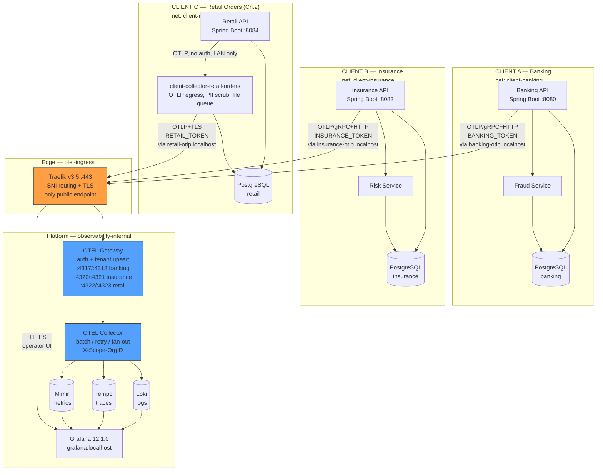
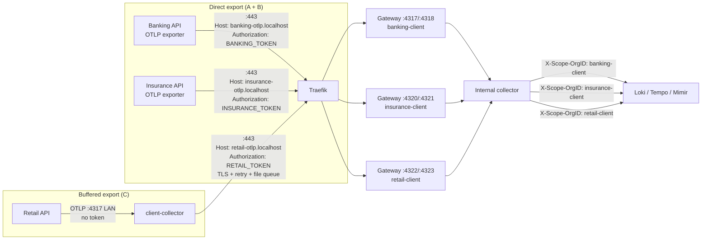
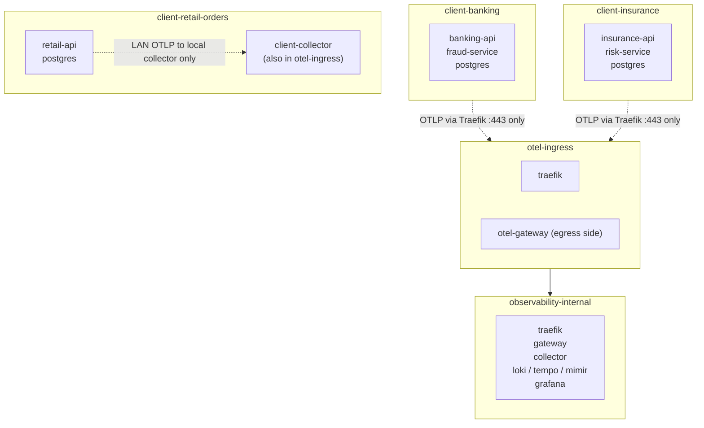
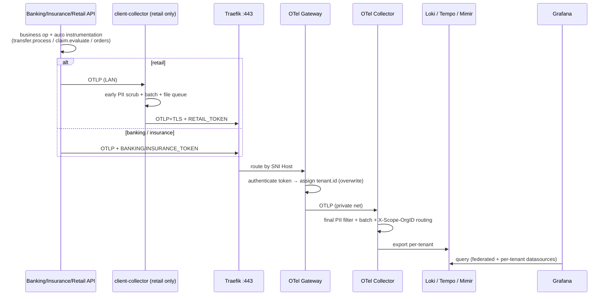

# Architecture — Centralized Multi-Tenant Observability POC

> Source of truth: `README.md`, `PRD.md`, `docker-compose.yml`, `observability/otel/*.yaml`, `observability/traefik/dynamic/routes.yml`.
> Render this file on GitHub / IntelliJ / VS Code (Mermaid supported).

## 1. Overall system

## 2. Ingestion detail (ports, SNI, tokens)

Gateway is authoritative: it maps credential → tenant and **overwrites** any `tenant.id` sent by the app or client-collector (FR-06, spoof-proof — see `tests/tenant-isolation/spoof-proof.sh`).

## 3. Network boundaries

Denied (enforced by Compose networks, no host ports on backends):

* Client A ✕ Client B/C, ✕ Loki/Tempo/Mimir/Grafana/internal-collector
* Client C app ✕ gateway directly (only its local collector may egress)
* Gateway OTLP ports (`4317/4318, 4320/4321, 4322/4323`) on `observability-internal` only

## 4. Telemetry flow (Metrics → Trace → Logs)

Investigation path: Grafana Tenant Overview → p95 latency spike (Mimir) → exemplar trace (Tempo, e.g. `fraud.check = 2.5s`) → correlated logs (Loki, e.g. `External risk provider timeout`).

## 5. Compose layout

| File | Stack | Networks |
|---|---|---|
| `docker-compose.yml` | traefik, otel-gateway, otel-collector, loki, tempo, mimir, grafana | `otel-ingress`, `observability-internal` |
| `custumers/digital-banking-services/` + `fraud-service/` | banking-api, fraud, postgres | `client-banking-network` |
| `custumers/insurance-services/` + `risk-service/` | insurance-api, risk, postgres | `client-insurance-network` |
| `custumers/retail-orders-services/` | retail-api, client-collector-retail-orders, postgres | `client-retail-orders` (+ `otel-ingress` for collector only) |

Ops: `./scripts/up.sh` → `./scripts/load-k6.sh --duration-min 5 --vus 10` (k6 in Docker, no local install) → Grafana Tenant Overview. Config edits need container restart (except Traefik file provider). See `README.md` Ops runbook.
